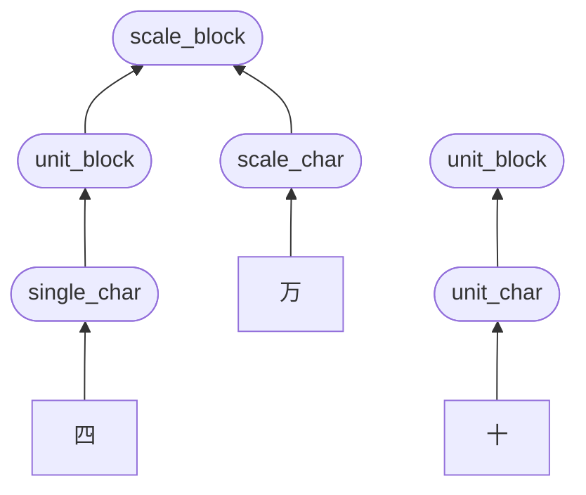

# 日本の郵便で使われるカスタマーバーコードを生成するJavaScriptライブラリを作った
たまには作ったものの紹介もしてみようという話です。

## 作ったもの
郵便物の宛先につけるバーコードを生成する js ライブラリ。

* [jpcbar.js](https://github.com/awazo/jp-post-customer-barcode)

* [デモ](https://awazo.github.io/jp-post-customer-barcode/)

# 作ったものの説明
使いかたと特徴など。

## 使いかた
```js
let jpcbar = new Jpcbar();
jpcbar.generate('3170055', '十一丁目六番地一号　郵便タワー601', document.getElementsByClassName('result'));
```
のようにすると、`jpcbar.generate` の第三引数の要素に SVG でバーコード画像が生成される。
第三引数が無いと、`{ "code": 生成したコード, "image": 生成した SVG 要素 }` が返る。
`jpcbar.generate` のほかに `jpcbar.generateFromAddressNumber` もあって、こっちは第二引数が住所ではなく、住所表示番号というものを受け付ける。そこ以外は `generate` と同じ。住所表示番号は住所から抜き出して作成する番号 (後述) 。
あと、第三引数ありのときには、その要素に `data-jpcbarjs-generated` 属性で生成したコードを持たせる。
```
<div class="result"></div>
```
を第三引数に指定すると、以下のようになる。
```
<div class="result" data-jpcbarjs-generated="start 3 1 7 0 0 5 5 1 1 - 6 - 1 - 6 0 1 CC4 CC4 CC4 5 stop">
<svg (属性略) >
 (略)
</svg>
</div>
```
具体的には [デモ](https://awazo.github.io/jp-post-customer-barcode/) を見てほしい。

## 特徴など
* ブラウザで使える
* jQuery や Vue や React などのフレームワーク非依存 (素の JavaScript)
* 住所からのバーコード生成ができる (住所表示番号からもできる)
* 代表の郵便番号への対応
    * 郵便番号の末尾が `00` はカスタマーバーコードを付番しない [仕様 (リンク先の末尾に記載あり)](https://www.post.japanpost.jp/zipcode/zipmanual/p18.html)
* 1000 件程度なら処理の存在を感じない程度の性能 (個人の感想です)
* MIT ライセンス

案外とカスタマーバーコードを生成するソフトウェアやライブラリは既に存在する。
[Word でもできるらしい](http://office-qa.com/Word/wd989.htm) し、[C# で作っている人もいる](https://qiita.com/ShTair/items/10cc006a6748e229c0d5) みたい。
jpcbar.js はブラウザで宛名ラベルを表示して印刷しようという案件がきっかけで作成されたものだ。案件個別の処理やデータは含まないのでライブラリとして公開している (当たり前だけど大事なことなので書いておく) 。MIT ライセンスを適用することにした (商用、非商用を問わず自由に使えるけど、保証も補償も保障も責任も無い、的なやつだ) 。
無償に限定すると、住所表示番号からはバーコード生成してくれるライブラリもあるのだけれど、それにはいちばんたいへんな、住所から住所表示番号を生成する処理が含まれない。先に挙げた C# のものも、入力として想定しているのは住所表示番号のほうで、チェックデジットの計算とバーコード画像の生成をしてくれるもののようだ。
Word を含めて有償のものなら、住所からカスタマーバーコードを生成してくれるものがあるようだ。
実は [郵便局のページ](https://www.post.japanpost.jp/send/fee/how_to_pay/uke_cyaku/barcode/) にもある。けれど本家にもかかわらず、整理番号なる謎の入力はあるものの、住所も住所表示番号も入力できないので、どうもこれはいまひとつ違いそう。先の C# の人も書いているように、生成結果の画像も扱いにくいものになっている。
jpcbar.js は、住所にも住所表示番号にも対応した。生成するのは 1 つの SVG 画像だ。使用しているのは素の JavaScript で、どのフレームワークも使っていないので、各フレーワーク用にパッケージングしてくれるなら大歓迎だ。依存しているといえば、DOM と SVG くらいかと思う。
大量の郵便物に印字することで料金割引になるカスタマーバーコードなので、当然いちどにたくさんの宛名に対してバーコード生成処理をすることになるが、具体的な計測値を記録していないけれど、1000 件で試して処理の完了を待つといった瞬間は体感しなかった。生成済みの画面を表示したような感じだった。とはいえもちろん環境によるので、必要なら性能は計測してもらいたい。

### 追加した処理
[郵便局の仕様](https://www.post.japanpost.jp/zipcode/zipmanual/index.html) には記載が無いが、全角数字を半角数字に変換する処理を追加している。
また、漢数字を算用数字に変換する処理は [仕様](https://www.post.japanpost.jp/zipcode/zipmanual/p19.html) (「抜き出しの補足ルール」の1.) に従っているが、漢数字として扱う文字に規定が無いため、〇、一、二、三、四、五、六、七、八、九、十、百、千、万、を対応文字としている。

### 対応していないこと
住所から住所表示番号を生成するにあたり、住所を町域までとそれよりあとに分ける必要がある。住所表示番号にする住所は町域よりあとの部分だけだ。
けれど、この分割処理は jpcbar.js には含まれない。
どうやら都道府県の次の市区町村までが町域になるようだけれど、そのあたり、あまり明確には分からなかったからだ。
なので実用上は、市区町村までとそれよりあとに分割済みのデータが必要になる。

# カスタマーバーコードとは？
ここからは長い。これが何で、どう実装されているかを説明する。
郵便物にしか使えないのに、名前がカスタマーバーコードって抽象的に過ぎるんだよなあ、とは当然思うわけで、googleability も極めて低いので何のことやら分かりにくいのだけれど、ダイレクトメールとかの宛名の近くによく印字されているアレのこと。
このバーコードが印字されていると、大量に送るときなどに [料金割引](https://www.post.japanpost.jp/zipcode/zipmanual/p30.html) があるらしい。なので、個人の郵便物で関係あることは、ほぼ無いのだけれど、企業システムだとたまに関わることもあるかも。
郵便局の公式の仕様は [こちら](https://www.post.japanpost.jp/zipcode/zipmanual/index.html) にある。
[Wikipedia の記事](https://ja.wikipedia.org/wiki/%E3%82%AB%E3%82%B9%E3%82%BF%E3%83%9E%E3%83%90%E3%83%BC%E3%82%B3%E3%83%BC%E3%83%89) も貼っておこう。

## カスタマーバーコードに含まれるデータ
カスタマーバーコードには主に 2 つのデータが含まれる。

* 郵便番号
* 住所表示番号

:::message
そのほかには、バーコードを構成するためのスタートコード (固定値) 、ストップコード (固定値) 、チェックデジット (主な 2 データからの算出値) がある。
:::

まあ郵便番号は分かる。`123-4567` みたいなやつで、バーコードに含まれるのはハイフンなしの数字 7 桁になる。
で、問題なのが住所表示番号なるもので、これは住所から作られるのだけれど、その工程はやや複雑だ。
まずは、住所のうち町域よりあとを取り出す。この時点でまず難しい。町域までは (たぶん) わりと郵便番号でカバーされているようで、そのほかの部分なイメージだ (あくまでイメージね) 。町域というのも聞き慣れないけれど、おおむね都道府県の次の市区町村あたりを言うような気がする。有名な KEN_ALL 地獄のことを思うと、このへん何も確かなことが言えない。。。[参考](https://blog1.mammb.com/entry/2020/02/11/015807)、[参考](https://qiita.com/nanasess/items/0f0aeaa1f72f599b9142)、[参考](https://uteee.com/system/5372/)
そのあと、[ここ](https://www.post.japanpost.jp/zipcode/zipmanual/p24.html) のフローチャートの右側にある「バーコード情報の抜き出し方法」の処理をする。具体的には [ここ](https://www.post.japanpost.jp/zipcode/zipmanual/p19.html) に記載の処理になる。
この処理が済めば、あとは郵便番号と住所表示番号をバーコード用にエンコードする。コード体系は [ここ](https://www.post.japanpost.jp/zipcode/zipmanual/p11.html) に記載されている。合わせて 20 個のコードにする。不足したら `CC4` を必要なだけ足す。
1 桁の数字はコードでも 1 個なので、郵便番号は 7 個のコードになるため、住所表示番号だけで 13 個のコードを埋めることになる。
あとはチェックデジットを計算して、スタートコードとストップコードと合わせてバーの図形を並べて完成となる。幅や高さの決まりはコード体系のところに記載がある。余白は [ここ](https://www.post.japanpost.jp/zipcode/zipmanual/p13.html) に記載がある。

## 住所から住所表示番号を生成
[ここ](https://www.post.japanpost.jp/zipcode/zipmanual/p19.html) に記載の処理を、以下のように実装している。

https://github.com/awazo/jp-post-customer-barcode/blob/b4236d28ee77b290906ee445cb1e5aaabd5aff31/src/jpcbar.js#L25-L37

25 行目の `toUpperCase` が「抜き出しの基本ルール」の 1 。
26 行目の `numberZenToHan` が独自に追加した全角数字から半角数字への変換処理。
27 から 28 行目の `addressNumber.replaceAll(kansuujiRegexp, (match, p1, p2) => { return this.kansuujiToArabic(p1) + p2; })` が「抜き出しの補足ルール」の 1 。これについては後述。
29 行目の `/[&\/\.・]/g` から `''` への変換が「抜き出しの基本ルール」の 2 。
30 行目と 31 行目の `/[^-0-9A-Z]/g` から `'-'` への変換と `/[A-Z]{2,}/g` から `'-'` への変換が「抜き出しの基本ルール」の 3 と 4 。
32 行目の `/([0-9])F/g` から `'$1-'` への変換が「抜き出しの補足ルール」の 2 と 3 。
33 行目の `/-+/g` から `'-'` への変換が「抜き出しの基本ルール」の 5 。
34 行目の `/^-/g` から `''` への変換が「抜き出しの基本ルール」の 6 。
35 行目の `/-$/g` から `''` への変換は、32 行目で F を固定でハイフンに変換しているため、末尾に残ったものを除去する処理。
36 行目と 37 行目の `/([A-Z])-/g` から `'$1'` への変換と `/-([A-Z])/g` から `'$1'` への変換が「抜き出しの補足ルール」の 4 。
「抜き出しの補足ルール」の 5 については、とくに処理することは無い。

### 漢数字から算用数字への変換処理
上記の 27 から 28 行目にある漢数字から算用数字への変換処理 (「抜き出しの補足ルール」の 1 に該当する) については以下の実装になっている。

https://github.com/awazo/jp-post-customer-barcode/blob/b4236d28ee77b290906ee445cb1e5aaabd5aff31/src/jpcbar.js#L20-L23

https://github.com/awazo/jp-post-customer-barcode/blob/b4236d28ee77b290906ee445cb1e5aaabd5aff31/src/jpcbar.js#L100-L111

上記の個所で `kansuujiSimple` と `kansuujiUnit` と `kansuujiScaleUnit` を合わせて `addressSuffix` の前にある文字列に該当する正規表現を作成している。
`replaceAll` の第二引数には該当したものに適用する関数を渡せるので、27 から 28 行目のようにして `kansuujiToArabic` を呼び出している。`kansuujiSimple` と `kansuujiUnit` と `kansuujiScaleUnit` に分けて定義してあるのは、この処理で使用するためだ。

```js
addressNumber.replaceAll(kansuujiRegexp,
  (match, p1, p2) => { return this.kansuujiToArabic(p1) + p2; })
```

少し長い (80 行ほどある) が、以下が `kansuujiToArabic` の実装になる。

https://github.com/awazo/jp-post-customer-barcode/blob/b4236d28ee77b290906ee445cb1e5aaabd5aff31/src/jpcbar.js#L159-L237

漢数字の特徴として、まずは単純な数を表す文字 (一や二など) と桁を表す文字 (十や百など) に分けることができる。もちろん後者が単独で数を表すこともあるが、二十のように二を十の位に移動させる機能も持っている。
桁を表す文字のなかでも、千と百と十はほかと異なる。ほかの、例えば億や万はより大きい桁の前に置くことができない。億万という数は 100,010,000 になるけれど、万億という数はひとつの算用数字にはならない。10,000 と 100,000,000 になる。万億を (百万を 1,000,000 = 百 * 万 と同様に) 10,000,000,000,000 のような数とすることはできない。それは十兆 (桁あってるかな) であるはずだからだ。※ただし文章表現としてはあり得る、ここではあくまで算用数字への変換対象としての漢数字を扱う。
もちろん千と百と十にも同様に、この順でしか登場できないという制限はあるが、この 3 文字は、億や万の前に置くことができるという点で桁としての扱いが異なる。百億は可能だが、万億は不可能だということだ。
これが、`kansuujiUnit` と `kansuujiScaleUnit` に分けた理由というわけだ。
:::message
広く使われている算用数字の桁区切りが 3 桁ごとの一方で、漢数字の桁区切りは 4 桁ごとなので少しややこしいが、1,0000,0000 のように 4 桁区切りで書くとき、カンマで区切られた中が千、百、十といった桁で、カンマで分割したまとまりごとに億、万といった桁になっているといったイメージになる。
:::

で、この処理を最初はズルズルと行き当たりばったりで作っていたのだけれど、どうしても網羅的に書けている気がしていなかった。当初は上記のよううな桁の違いにも気づけていなかったこともあった。この記事を書いている途中でソースコードを読み返していてバグを見つけたほどだった (修正済み) 。
そこで、構文解析の手法を使って Shift-Reduce 遷移表 (正式名称はなんて言うのか忘れた) を、それっぽく作ってみた。ソースコードのコメントに記載してある。

https://github.com/awazo/jp-post-customer-barcode/blob/b4236d28ee77b290906ee445cb1e5aaabd5aff31/src/jpcbar.js#L112-L133

https://github.com/awazo/jp-post-customer-barcode/blob/b4236d28ee77b290906ee445cb1e5aaabd5aff31/src/jpcbar.js#L148-L158

上側のコード片が遷移表で、下側のコード片が操作の説明になる。本当は単に Shift すべきところを、stack の深さを 2 より大きくしたくなかった都合上、Pop や Deque といった操作を追加している。
縦に並んでいる Empty から S10 までが、stack の各状態に対応していて、横軸の none から $ が次の文字だ (`$` は文字ではなく入力の終端 = 次の文字は無いという意味) 。ここでは漢数字文字そのものではなく、`this.kansuujiUnitType` で分類済みのデータを扱う。`kansuujiSimple` が `kansuujiUnitType.none` で、`kansuujiUnit` と `kansuujiScaleUnit` がそれぞれ `kansuujiUnitType.unit` と `kansuujiUnitType.scale` になる。unit と scale に _small や _big と付いているのは、桁同士の大きさを表わしていて、現在の stack にある最後尾かつ次の文字と同じ kansuujiUnitType のものを基準にして、それよりも次の文字が小さい桁かそうでないかという意味にしている。たとえば `[ 百 二 ]` の次が十なら unit_small として扱い、百や千なら unit_big として扱う。scale_small と scale_big も兆や億や万について同様だ (jpcbar.js が対応しているのは万だけだが) 。

```
             none, unit_small,  unit_big, scale_small, scale_big,          $
  Empty:      S00,        S01,       S01,         S02,       S02,        FIN
    S00:  End+S00,        S03,       S03,         S04,       S04, End+GEmpty
```

遷移表は、たとえば、Empty の行は、stack が空 (`[]`) で、次の文字が none のとき、S00 になる、のように読む。S00 は、下側のコード片のコメントで記載してあるように (`Sxx = ...` の行) 次の文字を stack に入れて、現在の状態を S00 に変える (goto Sxx) 。そうすると S00 の行を見ることになり、そこでまた次の文字が none であれば、End+S00 なので End つまり stack の先頭を結果の配列に入れて (End = Deque なので Deque の処理になる) 、S00 に現在の状態を変える、つまりまた S00 の行を見ることになる。
```
             none, unit_small,  unit_big, scale_small, scale_big,          $
    S03: RedM+S05,   RedM+S06,  EndM+S01,    RedM+S07,  RedM+S07,   RedM+G01

  S03: [ none unit ]
```
別の例として、S03 で次の文字が unit_small のときを見てみよう。stack の状態は S03 なので `[ none unit ]` になる。遷移表の記載は RedM+S06 なので、RedM つまり stack の内容を掛け合わせてひとつにして、状態は S06 つまり `[ unit unit ]` になる。この stack の最初の unit は S03 のときに stack にあった none と unit を掛けたもので、stack の末尾の unit は次の文字 unit_small だったものになる (Shift したので次の文字が  stack に入る) 。具体的な漢数字で書くと例えば、`[ 二 百 ]` の次に十が来たので、`[ "二百" 十 ]` にしたことになる (`"` は見やすさのためだけに付けた、"二百" は unit として扱う) 。もちろん二百十であれば、いちどに 210 になっても良いのだけれど、Reduce (= stack からいくつか pop して、ひとつにまとめて push する) と Shift (= 次の入力を stack に push する) でできるだけやろうとすると、こんな感じになるだろう。
S00 で次が none のときや、S03 で次が unit_big のときなど、jpcbar.js ではひとつづきの漢数字の文字列がひとつの算用数字のみになる前提を置いていない。たとえば `[ 二 ]` の次が三のとき (S00 で次が none のとき) には、ひとつの算用数字になる漢数字列のみを入力として扱うのであればエラーとすべきところを、二はそのまま result (結果を入れる配列として用意した) に入れて `[ 三 ]` を新たな S00 にしている (`End+S00`) 。jpcbar.js は住所を扱うために、このような動作にしている。同様に `[ 二 百 ]` の次が千のとき (S03 で次が unit_big のとき) には、二百は結果として取り出しておいて、`[ 千 ]` として S01 に遷移する (`EndM+S01`) 。
もっとも、三十二千といったものを、三十二と千だと見るか、三十と二千だと見るかは、意見が分かれそうではある。jpcbar.js では、S05 (`[ "三十" 二 ]`) で次が unit_big ("千") のときとして、Deque (三十を結果として取り出す) して S03 (`[ 二 千 ]`) に遷移している。つまり三十と二千として扱う処理としている。
```
             none, unit_small,  unit_big, scale_small, scale_big,          $
    S05: EndA+S00,   PopM+S06, Deque+S03,    RedA+S04,  RedA+S04,   RedA+G00

  S05: [ unit none ]
```

実装に際しては、stack の深さが 2 の部分について、以下のように stack の末尾の要素が同じものごとに並べ替えたものを使用した。

https://github.com/awazo/jp-post-customer-barcode/blob/b4236d28ee77b290906ee445cb1e5aaabd5aff31/src/jpcbar.js#L135-L146

:::message
S04 の行と S07 の行が同じになっていることが分かる。これはまあ、そうなるよね、といったところだろう。
:::

:::message
stack の最後尾が何かを見ることがよくあるので、状態を以下のように stack 末尾で揃うように並べてみると、少しだけ分かりやすくなるかもしれない。

| # | stack | | # | stack | | # | stack |
| ---- | ---- | ---- | ---- | ---- | ---- | ---- | ---- |
| S00 | [ none ] || S01 | [ unit ] || S02 | [ scale ] |
| | || S03 | [ none unit ] || S04 | [ none scale ] |
| S05 | [ unit none ] || S06 | [ unit unit ] || S07 | [ unit scale ] |
| S08 | [ scale none ] || S09 | [ scale unit ] || S10 | [ scale scale ] |
:::

また、RedM と RedA は、stack 内の 2 トークン同士の桁の大小で判別できることが分かったので、実装上はひとつの関数にまとめている (162 行目から 176 行目) 。
stack 内が `[ 大 小 ]` なら足し算、`[ 小 大 ]` なら掛け算になる。そのほかの場合は stack を変更しない (pop したものを戻して return している) 。
```
    const reduce = (stack) => {
      if (stack.length < 2) return;
      let lastElm = stack.pop();
      let lastPrevElm = stack.pop();
      if (lastPrevElm.unitSize > lastElm.unitSize) {
        lastElm.value += lastPrevElm.value;
      } else if (lastPrevElm.unitSize < lastElm.unitSize) {
        lastElm.value *= lastPrevElm.value;
      } else {
        stack.push(lastPrevElm);
        stack.push(lastElm);
        return;
      }
      stack.push(lastElm);
    };
```
reduce がこうなる理由は、stack には unitType が同じなら桁が小さくなる順 (降順) でしか入れないように遷移表を作っていることが関係ある。`[ 小 大 ]` となるのは、unitType が異なる場合のみにしている。
たとえば stack に unit が含まれる状態は、S01, S03, S05, S06, S07, S09 があるが、それらの場合に unit_big が次の文字だと、S07 を除いて End か Deque する処理としている。stack 末尾が unit である S01, S03, S06, S09 は、百のあとに千がきたら、ひとつの算用数字にはならないので、分かりやすいかと思う。S05 `[ unit none]` については、先述の三十二千の場合なので unit("三十") を Deque して `[ 二 千 ]` となるようにしている。S07 `[ unit scale ]` については、十万百のような場合を想定していて、`[ 十 万 ]` の次の文字が百だったら、stack の中身は Reduce して scale("十万") となるので、`[ "十万" 百 ]` の `[ scale unit ]` の状態 (S09) に遷移する。これで stack 内に同じ unitType なら降順でのみ入るようにしている。

そんなわけで、漢数字を算用数字に変換するのは、案外と骨が折れた。

#### (たぶん) 本来の Shift-Reduce
ちょっと脇道に逸れて、構文解析の話をしてみる。いつも分かったようで分かってない気がするので、今回の実践と昔教わった記憶からまとめてみようと思う。
本来の Reduce は、BNF のような形式文法を記述した式の右辺を左辺に変換する処理になる。
```
R01: kansuuji ::= scale_block unit_block | scale_block | unit_block
R02: scale_block ::= scale_block unit_block scale_char | unit_block scale_char
R03: unit_block ::= unit_block single_char unit_char
                  | unit_block unit_char | unit_block single_char
                  | unit_char | single_char
```
上記のようなもので、とりあえず R01 から R03 までのラベルを付けてある。(本当は | で分かれたひとつずつのパターンに別のラベルを付けたほうが分かりやすいけれど、文法定義としては上記記述の方が見やすいので、ここではこれでいく)
ここに登場する字句の定義は jpcbar.js の対応範囲では以下のようになる。
```
scale_char ::= "万"
unit_char ::= "千" | "百" | "十"
single_char ::= "〇" | "一" | "二" | "三" | "四"
              | "五" | "六" | "七" | "八" | "九"
```
たとえば入力が "四万十" であった場合、最初の文字 "四" は字句定義において single_char だ (single_char は R03 により、そのままで unit_block になることもできるが、まずは次の文字が字句としては何かを判別する) 。このとき stack は Empty なので、その状態で "四" (single_char) が次の文字だった場合には、Shift して stack が `[ single_char("四") ]` になる。
```
       single_char,
Empty:         S00,
  S00:            ,

S00 = [ single_char ]
```
その次は "万" で字句定義は scale_char となる。stack の末尾 single_char の次が scale_char となる文法は無いので、この場合は Reduce で R03 を適用して stack の single_char を unit_block にして stack に戻す (R03 の右辺から左辺に変換する) 。
```
       single_char, scale_char,
Empty:         S00,           ,
  S00:            ,        R03,
  S01:            ,           ,

S00 = [ single_char ]
S01 = [ unit_block ]
```

unit_block("四") (stack の末尾) と scale_char("万") (次の文字) が並ぶことはできる (R02 の定義。まだ適用しない) ので、ここでは Shift して良い。
```
       single_char, scale_char,
Empty:         S00,           ,
  S00:            ,        R03,
  S01:            ,        S02,
  S02:            ,           ,

S00 = [ single_char ]
S01 = [ unit_block ]
S02 = [ unit_block scale_char ]
```
次が "十" なので、unit_char で、stack の中のトークンと続くことはないので、まず Reduce して stack 内を変更する (R02 適用で scale_block にする) 。
```
       single_char, scale_char, unit_char,
Empty:         S00,           ,          ,
  S00:            ,        R03,          ,
  S01:            ,        S02,          ,
  S02:            ,           ,       R02,
  S03:            ,           ,          ,

S00 = [ single_char ]
S01 = [ unit_block ]
S02 = [ unit_block scale_char ]
S03 = [ scale_block ]
```

で、stack 末尾の scale_block("四万") のあとに入力 unit_char("十") が続く文法定義があるかと見ると、無い。scale_block 単体で R01 を適用して kansuuji として読み込み終了となると、うしろに余計な文字 unit_char("十") が続くので、この入力は受け付けられないためにエラーとなってしまう。
実際は、scale_block のうしろには unit_block が続くことができて (R01) 、unit_block の先頭には unit_char が存在できる (R03 の unit_block ::= unit_char のパターン) 。なので、ここではエラーにするのではなく Shift して良い。
```
       single_char, scale_char, unit_char,
Empty:         S00,           ,          ,
  S00:            ,        R03,          ,
  S01:            ,        S02,          ,
  S02:            ,           ,       R02,
  S03:            ,           ,       S04,
  S04:            ,           ,          ,

S00 = [ single_char ]
S01 = [ unit_block ]
S02 = [ unit_block scale_char ]
S03 = [ scale_block ]
S04 = [ scale_block unit_char ]
```
もう入力は無いので、次の文字としては $ (入力の終端) になる。S04 からそのまま Reduce はできないので、R03 (unit_block ::= unit_char) を適用して Reduce する。
```
       single_char, scale_char, unit_char,   $
Empty:         S00,           ,          ,    
  S00:            ,        R03,          ,    
  S01:            ,        S02,          ,    
  S02:            ,           ,       R02,    
  S03:            ,           ,       S04,    
  S04:            ,           ,          , R03
  S05:            ,           ,          ,    

S00 = [ single_char ]
S01 = [ unit_block ]
S02 = [ unit_block scale_char ]
S03 = [ scale_block ]
S04 = [ scale_block unit_char ]
S05 = [ scale_block unit_block ]
```

次の入力は変わらず $ なので、R01 (kansuuji ::= scale_block unit_block) を適用して Reduce する。そうすると kansuuji として全部を読み終えることができるので、無事に読み込み成功とすることができる。
```
       single_char, scale_char, unit_char,   $
Empty:         S00,           ,          ,    
  S00:            ,        R03,          ,    
  S01:            ,        S02,          ,    
  S02:            ,           ,       R02,    
  S03:            ,           ,       S04,    
  S04:            ,           ,          , R03
  S05:            ,           ,          , FIN

S00 = [ single_char ]
S01 = [ unit_block ]
S02 = [ unit_block scale_char ]
S03 = [ scale_block ]
S04 = [ scale_block unit_char ]
S05 = [ scale_block unit_block ]
```

といったように Shift-Reduce の遷移表を埋めていったり (表を作るとき) 、またこの表を使って入力をツリー構造にまとめていきながら文法エラーが無いことを確かめる (表を使って入力を解析 (parse) するとき) 。というのが構文解析で、コンパイラなどプログラム言語を読み込んで実行形式に変換する処理の最初の部分でも行われている (本当の最初は字句解析ではあるけれども) 。たとえば関数は予約語functionと空白と関数名とブロックからできていて、予約語functionは "f" と "u" と "n" と……からできていて、空白は半角空白かタブか改行で、関数名はアルファベットから始まってアルファベットまたは数字またはいくつかの記号が続く文字列で、アルファベットとは (中略) で、ブロックは "{" と文の 0 個以上の繰返しと "}" で、というツリー構造が作られると、ツリーの中で関数というノードに行き当たったら、実行形式への変換または直接実行する際に、その部分の文字列 (ソースコード) が関数だと分かったうえで処理することができる。
プログラムそのものに限らず、テキストベースのデータを読み込むときにも、LR(1) 程度の範囲の形式文法であれば、こうした処理でパースすることができる。
もっとも、字句解析や構文解析は処理を自動で生成してくれるツールがあるので、それを使うのが一般的ではあるだろう。yacc/lex とか (今も使われてるのかな？ もっと別なツールがあるのだろうか) 。

余談が過ぎた。実際の漢数字は、桁同士の大小で連続した入力かどうかが違う ("百十" は連続した入力といえるが "十百" は十と百になる (またはエラーとして扱う) 。つまり同じ unitType 内で桁が小さくなる順にしか連続しない) ので、ここに書いた R01 から R03 の文法定義では正しくパースできない。(たとえば "十百" は以下のようなツリーを構築して、ひとつの算用数字として読み込み成功となる)
なのでちょっとアレンジして実装している。けっしてテキトーにやったからじゃないということにしておいてほしい。


## データのコード化
郵便番号と住所表示番号ができたら、あとはそれをコード化する。
コードには [こちら](https://www.post.japanpost.jp/zipcode/zipmanual/p11.html) の表にあるキャラクタとコード組合せの列を見て変換できる。
ここで扱うデータには数字、ハイフン、アルファベットのみがあるので、キャラクタ欄にある CC1 から CC8 とスタートとストップは今は考慮しなくて良い。
実装は以下のようになっている。

https://github.com/awazo/jp-post-customer-barcode/blob/b4236d28ee77b290906ee445cb1e5aaabd5aff31/src/jpcbar.js#L239-L247

変換の本体は `this.charToCode` で、あとは 20 個で切って (244 行目) 、不足を `'CC4'` で埋めている (245 行目) 。
charToCode は以下の実装になっている。

https://github.com/awazo/jp-post-customer-barcode/blob/b4236d28ee77b290906ee445cb1e5aaabd5aff31/src/jpcbar.js#L288-L293

アルファベット以外はそのままで良く、アルファベットはコード組合せ欄に合うように計算している。

## チェックデジットの計算
計算方法は [ここ](https://www.post.japanpost.jp/zipcode/zipmanual/p21.html) に仕様がある。jpcbar.js での実装は以下のとおり。

https://github.com/awazo/jp-post-customer-barcode/blob/b4236d28ee77b290906ee445cb1e5aaabd5aff31/src/jpcbar.js#L318-L330

ここまででデータは数字とハイフンと CCx になっていて、数字はそのまま、ハイフンは 10 、CCx は 10 + x として計算するので、324 行目までで acc にその合計を算出している。
あとはこれにチェックデジットを足すと 19 の倍数になるようにするので、`acc % 19` で余りを計算して 19 から引くとチェックデジットの値になる (325, 326 行目) 。
残りの処理ではチェックデジットの値を、数字、ハイフン、CCx のいずれかで表わされるコードに変換している。

## コードの SVG 化
あとはもう、[コード表](https://www.post.japanpost.jp/zipcode/zipmanual/p11.html) を持っておいて (`this.barPattern`) 、コードをバーの種類の配列としてひとつずつ SVG の RECT 要素にしていく (`this.codeToImage` 265, 266 行目) 。

https://github.com/awazo/jp-post-customer-barcode/blob/b4236d28ee77b290906ee445cb1e5aaabd5aff31/src/jpcbar.js#L294-L316

https://github.com/awazo/jp-post-customer-barcode/blob/b4236d28ee77b290906ee445cb1e5aaabd5aff31/src/jpcbar.js#L249-L286

SVG のための部品は末尾にまとめて置いてある以下の実装になっている。サイズについてはコード表の下にある `〔カスタマバーコードの寸法〕（10ポ相当）` の値を 10 倍で作成して、SVG 要素の属性や RECT 要素の属性の値を算出する際に `this.scale` の値を使って調整している (このへん、this.svg.xxx みたいにまとめた方が良かったかもしれない) 。
(余白については [こちら](https://www.post.japanpost.jp/zipcode/zipmanual/p13.html) に記載がある)

https://github.com/awazo/jp-post-customer-barcode/blob/b4236d28ee77b290906ee445cb1e5aaabd5aff31/src/jpcbar.js#L332-L385

# おわりに
長々とお読みいただき、ありがとうございます。
まさかバーコード生成ライブラリに構文解析を入れるとは作り始めた当初には思ってもなく、この記事もやたらと長くなってしまった。
[jpcbar.js](https://github.com/awazo/jp-post-customer-barcode) 、あまり使う機会は無いかと思うけれど、良かったら使ってやってくださいな。

